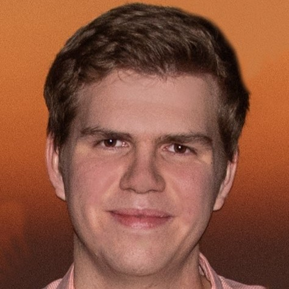

# Maximilien Bohm 

  

*Currently pursuing a Bachelor (BsC) in Mathematics and Physics. Will pursue a Master (MScT) in AI in 2022.*

## Hi there!  👋

My name is Maximilien Bohm. I am a student in Mathematics and Physics with a great interest in Computer Science and more specifically Quantum Computer Technologies.

## Interest Areas

       

## Projects

I am currently teaching myself my way around Arch Linux and setting up my environment. I have some projects on the Linux Kernel, especially fixing firmware driver issues with my HP Pavilion Laptop.
I have been working on the Linux Kernel for 4 years now and know my way around the Linux Kernel and the Linux Terminal with some limited knowledge in Shell scripting.

## Programming Languages

I have some experience in programming and studying algorithms.
My programming experience includes proficiency in Python, Java, HTML&CSS and moderate proficiency in C. I have started learning Rust and Functional Programming Languages such as Haskell and it's GHC compiler.

## Languages

I speak fluently French, English and Swedish. Furthermore, I have intermediate profiency in Italian and Arabic.
